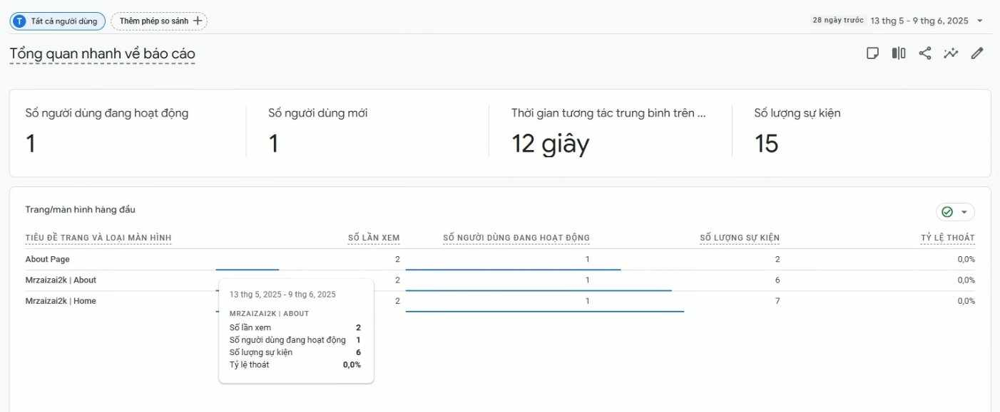

# Portfolio Website


[](https://github.com/mrzaizai2k/Portfolio)
[](https://opensource.org/licenses/MIT)
[](https://github.com/mrzaizai2k/Portfolio/releases)

🌐 **Live Site**: [mrzaizai2k.com](https://mrzaizai2k.com/)

🔹 [Report Bug](https://github.com/mrzaizai2k/Portfolio/issues)  
🔹 [Request Feature](https://github.com/mrzaizai2k/Portfolio/issues)

---

## 📑 Table of Contents

- [About](#about)
- [Tech Stack](#tech-stack)
- [Features](#features)
- [Setup](#setup)
- [Docker](#docker)
- [Cloudflare Tunnel](#cloudflare-tunnel)
- [Google Analytics](#google-analytics)
- [Usage](#usage)
- [Support](#support)

---

## About

Personal portfolio [mrzaizai2k.com](https://mrzaizai2k.com/) showcasing my projects, resume, and skills.  
Feel free to fork and customize! Credit to [Soumyajit](https://soumyajit.vercel.app/).

---

## Tech Stack

- React.js  
- Node.js  
- CSS3  
- Docker  
- Nginx

---

## Features

- 📖 Multi-page layout  
- 🎨 Customizable CSS  
- 📱 Responsive design  
- 🔒 Nginx DDoS protection  
- 🐳 Docker containerized

---

## Setup

> Requires `node.js`, `git`, `docker`.

1. **Clone the repo**:
   ```bash
   git clone https://github.com/mrzaizai2k/Portfolio.git
   cd Portfolio
   ```

2. **Install dependencies**:

   ```bash
   cd frontend
   npm install
   cd ..
   ```

3. **Add in `.env` file** 

   Take the Measuring_ID as in [Google Analytics](#google-analytics)
   ```
      REACT_APP_GA4_MEASUREMENT_ID=G-XXXXXX
   ```


---

## Docker

1. Ensure `docker` and `docker-compose` are installed.

2. Build and run:

   ```bash
   docker-compose up -d
   ```

3. Access your site: [http://localhost:80](http://localhost:80)

4. Stop containers:

   ```bash
   docker-compose down
   ```

> **Note**:
> `/frontend/src` is mounted as a volume for live code updates.
> Nginx runs on port 80 with built-in DDoS protection.

---

## Cloudflare Tunnel

Expose your site to the public using Cloudflare Tunnel:

Please read this [connecting_domain_cloudflare](docs/connecting_domain_cloudflare.md) to know how to connecting your domain with Cloudflare


1. **Install `cloudflared`**:

   ```bash
   chmod +x cloudflare/install_cloudflared.sh
   ./cloudflare/install_cloudflared.sh
   ```

2. **Authenticate**:

   This is neccessary, if you need to change domain, you need to login again

   ```bash
   cloudflared tunnel login
   ```

3. **Create and run tunnel**
   
   - (replace `<Tunnel-UUID>` and `<Tunnel-NAME>` accordingly):
   -  you need to remove existing A, AAA, CNAME records on cloudflare first (which was created whenever you ru create tunnel on different machines):

   ```bash
   cloudflared tunnel create <Tunnel-NAME>
   sudo cp -r /home/<your_username>/.cloudflared /root/.cloudflared
   sudo -i
   cd /root/.cloudflared/
   touch config.yml
   nano config.yml  # Edit tunnel UUID and settings
   ```

   Edit config.yml like this:
   ```yaml
   tunnel: <Tunnel-UUID>
   credentials-file: /root/.cloudflared/<Tunnel-UUID>.json
   ingress:
   - hostname: example-app.com
      service: http://localhost:80
      originRequest:
         noTLSVerify: true
         
   - service: http_status:404
   ```

   Keep doing

   ```bash
   sudo cloudflared service install
   sudo systemctl start cloudflared
   cloudflared tunnel route dns <Tunnel-NAME> <your_domain>
   cloudflared tunnel run <Tunnel-NAME>
   ```

4. **Stop tunnel**:

   ```bash
   cloudflared tunnel cleanup <Tunnel-NAME>
   ```

5. **Delete tunnel** *(after cleanup)*:

   ```bash
   cloudflared tunnel delete <Tunnel-NAME>
   ```

📚 Resources:
>
> * [Cloudflare Docs](https://developers.cloudflare.com/cloudflare-one/connections/connect-networks/do-more-with-tunnels/local-management/create-local-tunnel/#1-download-and-install-cloudflared)
> * [Medium Guide](https://freedium.cfd/https://medium.com/@al_imran_ahmed/how-i-turned-an-old-laptop-into-a-web-hosting-server-for-my-laravel-application-e9035692d56b)

---

## Google Analytics

1. Signing Up: Visit the Google Analytics website and sign up for an account using your Google credentials.

2. Creating a Property: Once logged in, create a new property within your Google Analytics account for the website or application you want to track. Provide relevant information, such as the website URL, industry category, and reporting time zone.

3. Generating Measuring ID: Upon creating a property, Google Analytics will ask that you create a data stream. Create a web data stream. If your project is still in development, you can use any domain of your choice, whether life or not. After creating a data stream, Google Analytics will generate a unique measuring ID. The measuring ID links your application and Google Analytics, allowing data collection and reporting to occur seamlessly.

4. Add in `.env` file 
```
   REACT_APP_GA4_MEASUREMENT_ID=G-XXXXXX
```

<p align="center"></p>
<p align="center"><i>Figure. Google Analytics </i></p>

Reference: https://blog.openreplay.com/integrating-google-analytics-with-react--a-full-guide/


## Usage

* **Customize frontend**:
  Modify components in `/frontend/src/components/`

* **Configure Nginx**:
  Edit `/nginx/nginx.conf.template`

* **View logs**:

  ```bash
  docker logs portfolio-frontend
  docker logs nginx
  ```

---

## Support

* [Report a Bug](https://github.com/mrzaizai2k/Portfolio/issues)
* [Request a Feature](https://github.com/mrzaizai2k/Portfolio/issues)

